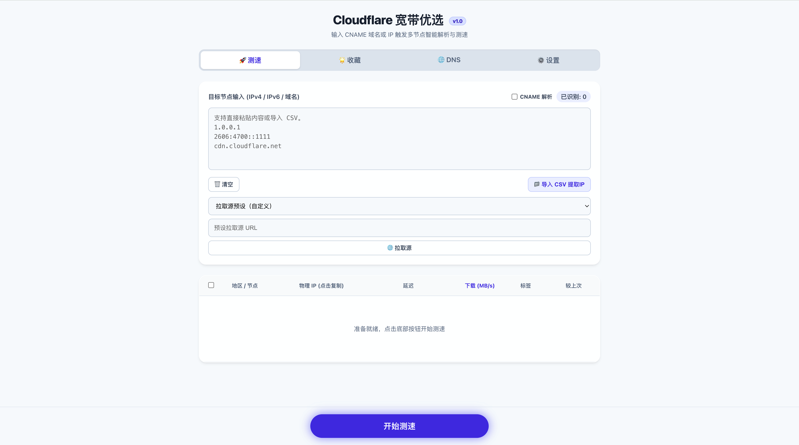

# cfst-web-panel

一个面向本地场景的 Cloudflare 节点测速与 DNS 同步面板。\
后端基于 `Node.js + Express` 调用 `cfst` 引擎测速，前端为单页静态页面，提供测速、收藏、DNS 管理与参数设置。

项目地址：<https://github.com/Amour795/cfst-web-panel>

## 界面预览



## 上游项目

- `cfst`（CloudflareSpeedTest）原项目地址：<https://github.com/XIU2/CloudflareSpeedTest>
- 本项目不是测速引擎本体，而是基于 `cfst` 的本地 Web 管理面板；`延迟/下载测速`、`结果 CSV 输出` 等核心能力均来自上游 `cfst`
- 本项目主要提供上层能力：可视化配置、任务进度展示（SSE/轮询）、收藏与历史管理、Cloudflare DNS 同步、主题切换等
- 运行时会直接调用项目根目录中的 `cfst` 可执行文件（Windows 为 `cfst.exe`，Linux/macOS 为 `cfst`），因此功能边界和参数语义与上游版本保持强关联
- 若上游 `cfst` 发布新参数或行为变更，本项目通常无需改动核心测速逻辑，但可能需要在前端设置项与参数映射上做同步适配
- 感谢上游作者与社区维护，本项目定位为“本地运维场景的增强面板”，不替代上游命令行工具

## 项目背景

这个项目用于解决以下常见痛点：

- `cfst` 命令行参数多，日常调参和批量测速门槛较高
- 需要把“测速结果”快速转化为“可用 DNS 解析记录”
- 需要在本地环境持续使用、保留历史结果和收藏节点
- 希望对测速任务有可视化进度、超时控制和中途停止能力

因此本项目采用“本地单体服务 + 浏览器面板”的方式，强调易用性、稳定性与可维护性。

## 核心功能

- `测速大厅`：支持粘贴、CSV 导入、远程拉取源并提取目标 IP/域名
- `输入模式`：支持 `IP` 模式与 `CNAME` 模式（域名自动解析 A/AAAA）
- `实时进度`：SSE + 轮询双通道显示任务阶段、比例和消息
- `引擎控制`：支持启动、超时终止、手动停止测速任务
- `收藏管理`：收藏、删除、批量测速、标签管理、复制导出
- `DNS 管理`：读取 Cloudflare 记录、单条删除、清空并批量同步优选 IP
- `地区识别`：优先使用 `result.csv` 的 `colo`，不足时自动探测补齐
- `设置持久化`：`cfst` 参数保存到 `database.json`，刷新后自动回显
- `暗色模式`：支持系统跟随 / 浅色 / 深色手动切换
- `系统维护`：可在面板触发测速引擎和官方 IP 段更新

## 技术架构

- 后端：`Express 4`、`multer`、原生 `fetch`、`child_process.spawn`
- 前端：`public/index.html + public/app.js`（无框架）
- 存储：`database.json`（收藏、设置、历史、最近目标）
- 测速引擎：项目根目录 `./cfst` 可执行文件
- 输出文件：`result.csv`（由 `cfst` 生成，后端解析后回传前端）

## 环境要求

- Node.js `>= 18`
- 操作系统：`Linux / macOS / Windows / Termux(Android)`
- 必备文件权限：项目目录可写（`database.json`、`result.csv`）
- 可执行文件：
- 非 Windows：`./cfst` 存在且具有执行权限
- Windows：`.\cfst.exe` 存在

## 安装与部署

### 推荐安装方式

#### Linux / macOS / Termux

```bash
bash -c "$(curl -fsSL https://raw.githubusercontent.com/Amour795/cfst-web-panel/main/install.sh)"
```

Linux/macOS/Termux 推荐使用一键脚本。

### Windows 手动安装（推荐）

```powershell
git clone https://github.com/Amour795/cfst-web-panel.git
cd cfst-web-panel
npm install
npm run build:min
# 下载并解压 cfst_windows_amd64.zip，放置 cfst.exe 到项目根目录
node .\server.js
```

### 启动访问

- 默认端口：`3088`
- 若 `3088` 被占用，服务会自动尝试 `3089`
- 访问地址以终端打印为准（通常 `http://localhost:3088`）

### 进程托管（可选）

建议长期运行时使用 `pm2`：

```bash
npm install -g pm2
pm2 start server.js --name cfst-web-panel
pm2 save
```

## 使用说明

### 1. 准备目标

- 在测速页粘贴 IP/域名，或导入 CSV
- 可通过“拉取源 URL”获取外部文本并自动提取目标
- `IP` 模式下会校验纯 IP，`CNAME` 模式允许域名参与解析

### 2. 执行测速

- 点击“开始测速”创建任务
- 进度面板显示“解析目标 -> Ping 测试 -> 下载测速 -> 结果解析”
- 任务结束后按策略排序并返回 TopN

### 3. 收藏与复测

- 勾选结果后可批量收藏
- 收藏页支持批量复测、打标签、删除、复制导出

### 4. DNS 同步

- 先在设置页填写 `Zone ID / 子域名 / Token`
- 在 DNS 页刷新记录，或将选中优选 IP 覆盖同步到 Cloudflare

### 5. 主题切换

- 设置页 `外观` 可选：`跟随系统`、`浅色模式`、`黑夜模式`

## 设置项与生效规则

- `GET /api/settings/cfst` 读取当前配置，`POST /api/settings/cfst` 保存配置
- 配置持久化到 `database.json -> settings.cfst_config`
- 刷新页面后会重新请求后端并回显当前有效值
- `disableDownload(-dd)`、`dnSingle`、`tl/tll/tlr/sl`、`allip`、`debug` 全部可保存
- `解析超时(秒)`、`任务总超时(秒)`支持自由设置
- 超时只受 Node 定时器技术上限影响（约 24.8 天）

## 主要 API

- `POST /api/start-test` 启动测速任务
- `POST /api/stop-test` 手动停止任务
- `GET /api/progress/:taskId` SSE 实时进度
- `GET /api/progress-state/:taskId` 进度轮询兜底
- `POST /api/fetch-source` 拉取远程目标源
- `GET /api/saved-ips` 获取收藏
- `POST /api/save-ips` 保存收藏
- `POST /api/delete-ips` 删除收藏
- `GET /api/settings/cf` 获取 CF 配置
- `POST /api/settings/cf` 保存 CF 配置
- `GET /api/cf/dns` 获取 DNS 记录
- `POST /api/cf/dns/sync` 批量同步 DNS
- `POST /api/system/update-engine` 更新 `cfst` 引擎
- `POST /api/system/update-ips` 更新 Cloudflare 官方 IP 段

## 目录结构

```text
.
├── public/
│   ├── index.html
│   ├── app.js
│   └── min.js
├── server.js
├── install.sh
├── package.json
├── database.json      # 运行时持久化数据
├── result.csv         # cfst 输出结果
├── cfst               # 非 Windows 引擎可执行文件
└── cfst.exe           # Windows 引擎可执行文件
```

## 运维与排障

### 服务启动失败

- 检查 Node 版本是否 `>=18`
- 检查 `cfst` 是否存在且可执行：`chmod +x cfst`
- 检查目录写权限（`database.json`/`result.csv`）

### 设置保存后刷新不一致

- 确认保存按钮提示成功
- 升级后端后请重启 `node server.js`
- 刷新页面后以接口回显值为准

### 任务过慢或易超时

- 增大 `任务总超时(秒)` 与 `解析超时(秒)`
- 减小并发参数（如 `n`、`dn`、`dt`）以换稳定
- 目标数很大时建议分批测速

## 开发与构建

- 开发启动：`node server.js`
- 前端压缩：`npm run build:min`
- 当前页面默认加载 `public/app.js`
- `public/min.js` 作为压缩产物保留，便于发布与分发

## 免责声明

- 本项目仅用于网络质量测试、学习研究和运维自用，请遵守当地法律法规与服务条款
- 用户应自行保管 Cloudflare API Token 等敏感信息，因泄露导致的风险由使用者承担
- 任何基于本项目的测速、解析变更、流量调度行为，后果由操作人自行负责
- 项目按“现状”提供，不对特定环境下的可用性、稳定性或适配性作担保

## 许可协议

默认遵循仓库中的许可证文件（如后续补充 `LICENSE`，以该文件为准）。
